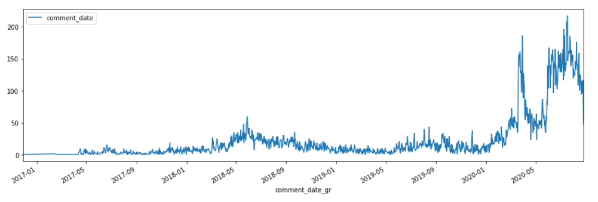

# Analysing Comments in Filimo.com

In this project I'm going to do some analysis on comments of users in filimo.com . I extracted data using Scrapy. 

I will do analysises like Number of comment per date, people likes/dislikes for each comment and make a ML model for it. 

I ignored uploading data to repo because they were so big. you can exract these data using the spiders i created (file_scrapper.py , -filimo.py), also you can contact me for data.